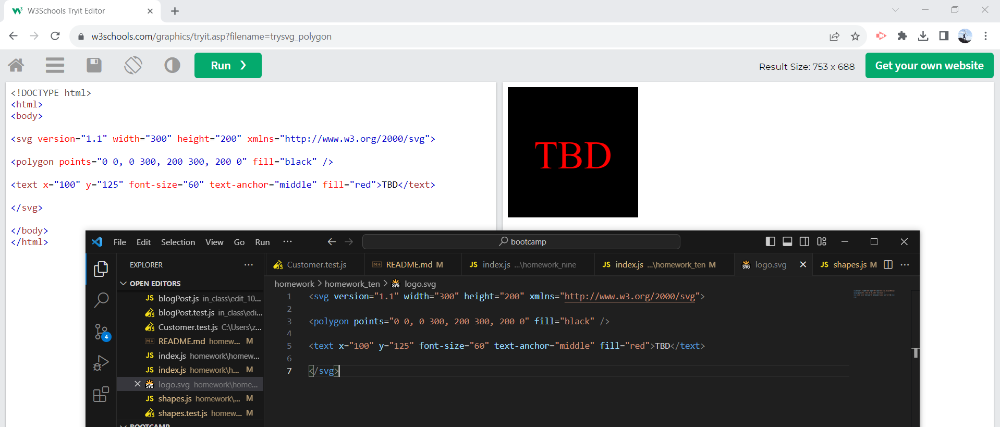

# **Module 10 Challenge:** NPM logo.svg maker

## Description

The goal of this project was to create a logo.svg file based off of user input. Class objects would be created based off of this input, before being read and used to create the logo.svg file. Additionally, a requirement of the project was to create some basic tests on the classes to ensure that they were generating things properly. The greatest struggle of the project was ensuring the files were hooked up properly, as well as using proper notation for importing/exporting/requiring the needed functions. The project runs completely in the terminal, using the command '  node index.js  ' to begin creating the logo.svg file, while '  npm test  ' will run the tests via jest. In addition to jest, inquirer@8.2.4 and the inherent fs modules were used in this project.

## Preview

The video linked here provides an example walkthrough of the code in action:
[logo.svg maker sample video](https://drive.google.com/file/d/183NjIdQybzTx2Coq9XOsdBRDZW9kP-zu/view)

Provided here is a screenshot of the code for the logo.svg file, as well as the image it creates: 